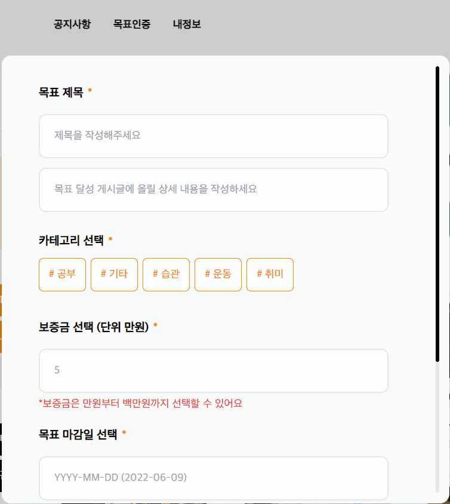

## 🥅 ****프로젝트 소개****

목표 달성 자극 서비스입니다. 목표와 함께 보증금을 등록하고 서로간의 검증을 통해 목표달성에 성공하면 보증금과 추가로 축하금을 줍니다. 반면, 달성에 실패하면 보증금을 가져갑니다. 

 

## 🖥 프로젝트 미리보기

[골키퍼 체험하기 >](https://tourmaline-churros-3e62da.netlify.app/)

<table>
  <tr>
    <td width="230px">
        
    </td>
    <td width="230px">
        
    </td>
    <td width="230px">
        
    </td>
  </tr>
  <tr>
    <td rowspan="1" align="center">
        <b>통계 기능</b>
    </td>
    <td rowspan="1" align="center">
        <b>목표 등록</b>
    </td>
    <td rowspan="1" align="center">
        <b>목표 인증 등록</b>
    </td>
  </tr>
  <tr>
    <td width="230px">
        
    </td>
    <td width="230px">
        
    </td>
    <td width="230px">
    </td>
  </tr>
  <tr>
    <td rowspan="1" align="center">
        <b>목표 인증</b>
    </td>
    <td rowspan="1" align="center">
        <b>목표머니 충전 </b>
    </td>
    <td rowspan="1" align="center">
    </td>
  </tr>
</table>

 

## 🤙 코딩 컨벤션

- 페이지 명, 컴포넌트 명, 라우트 경로 작명 시 pascal case 방식으로 작명하며 그 외의 모든 함수, 변수 등의 작명은 camel case 방식으로 작명하기로 했어요.
- page 구현 시 Container Presenter Pattern을 사용하여 구현하기로 했어요.
- Prettier, ESLint를 사용하여 코드 작성 규칙과 코딩 스타일을 맞추기로 했어요.

 

## ⌨ 협업 방식

- `Figma`, `Zeplin`에 디자인된 화면을 기반으로 UI / UX를 구현했어요.
- `Notion` 을 통해 진행 사항, 제안 사항, 참고 자료들을 기록했어요.
- `Discord` 의 음성 대화, 화면 공유를 활용하여 비대면으로 협업
- `Storybook`을 사용하여 input, button과 같은 공통 컴포넌트를 미리 확인하고 사용할 수 있도록 했어요.

 

## ✍️ 깃 사용 방법

- **브랜치 종류**
    - **main** : main 브랜치를 기준으로 배포를 진행했어요.
    - **develop** : 개발을 진행하는 중심 브랜치에요.
    - **feature** : 새로운 기능을 개발하는 브랜치에요.
    
 

- **Feature 브랜치 네이밍 규칙**
    - `{브랜치 종류}/{{기능이름}}`
    - ex) `feature/login`

 

## ⚡ 기술 스택

- `Typescript` : 코드의 안정성을 높이고 협업의 효율을 높이기 위해 Typescript를 사용했어요.
- `React` : component 단위의 개발, 사용자의 사용성을 고려한 SPA 개발을 하기 위해 React를 사용했어요.
- `Redux` : 프로젝트의 확장성과 유지 보수를 고려하고 action을 통해 상태를 추적하여 구조적으로 상태를 관리하기 위해 Redux를 사용했어요.
- `Redux-Saga` : Redux와 함께 사용하여 효율적인 API 로직을 작성하기 위해 Redux-Saga를 사용했어요.
- `Storybook` : 자신이 작업하지 않은 컴포넌트 또한 직관적으로 파악하기 위해 Storybook을 사용하여 공통 컴포넌트를 미리 확인하고 사용해 볼 수 있도록 했어요.
- `TailwindCSS` : Utility-First 컨셉으로 인해 쉽고 빠른 ui 작성이 가능, 클래스명 작성 고민을 덜며  모바일 버전 ui 작성의 용이하다는 점에서 선택했어요.
- `netlify` : Github 와 연동, https를 기본적으로 지원, 복잡한 구축 과정을 Netilfy에게 위임하여 배포했어요.

 

## 🌠 이슈

- 번들 파일 사이즈, 초기 로딩시간 감소를 위해  `React.lazy` 를 통해 필요할 때만 분리한 정크 파일을 로드하도록 했어요.
- 비동기 데이터 처리를 효과적으로 다루기 위해 `Redux-Saga` 와 `React` 의 CustomHooks를 이용하여 action에 따른 로딩, 결과, 에러 상태를 관리하도록 했어요.

 

## 🙋‍♂️ Member

<table>
  <tr>
    <td align="center">
      <a href="https://github.com/sancy1003">
         
        
          <b>박찬영</b>
        
      </a> 
    </td>
    <td align="center">
      <a href="https://github.com/jeongye01">
         
        
          <b>정예원</b>
        
      </a> 
    </td>
    <td align="center">
      <a href="https://github.com/ahn0min">
        
         
        
          <b>안영민</b>
        
      </a> 
    </td>
    <td align="center">
      <a href="https://github.com/robinjoon">
         
        
          <b>임수빈</b>
        
      </a> 
    </td>
    <td align="center">
      <a href="https://github.com/suyeon39">
         
        
          <b>수연</b>
        
      </a> 
    </td>
  </tr>
  <tr>
    <td rowspan="1" align="center">
        <b>FRONT-END</b>
    </td>
    <td rowspan="1" align="center">
        <b>FRONT-END</b>
    </td>
    <td rowspan="1" align="center">
        <b>FRONT-END</b>
    </td>
    <td rowspan="1" align="center">
        <b>BACK-END</b>
    </td>
    <td rowspan="1" align="center">
        <b>Design</b>
    </td>
  </tr>
</table>